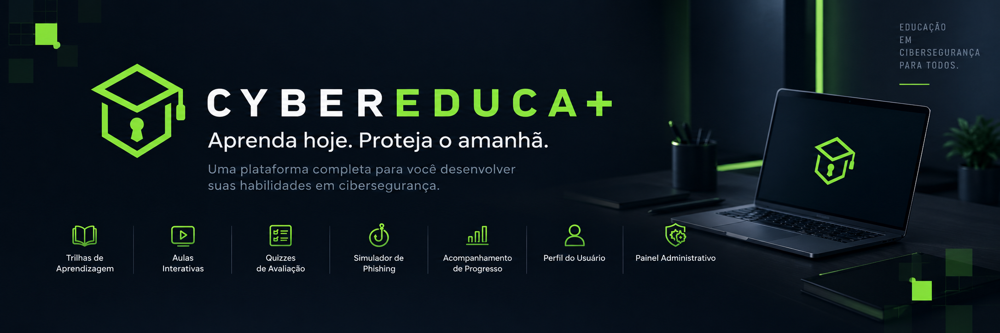
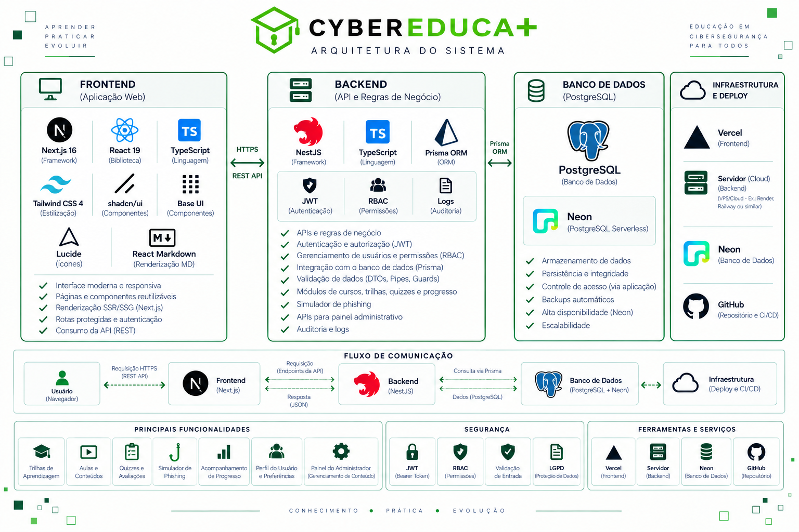

# CyberEduca+

> Plataforma web de aprendizagem em cibersegurança, com trilhas, quizzes e simulador de phishing — desenvolvida como Projeto Final de Curso (PFC) na UMC.




## Sobre o projeto


Desenvolvido como **Projeto Final de Curso (PFC)** da **Universidade de Mogi das Cruzes - UMC**, para os cursos de Bacharelado em Engenharia de Software e Bacharelado em Sistemas de Informação.

À medida que os ciberataques (phishing, golpes, força bruta) se tornam mais frequentes, cresce a necessidade de capacitação prática em segurança digital. O **CyberEduca+** propõe um site educacional com trilhas de aprendizagem, aulas, quizzes de avaliação e um simulador de phishing, incluindo autenticação de usuário, perfil básico e um painel administrativo para gestão de conteúdos e acompanhamento de desempenho.

**Fora do escopo do MVP:** aplicativo móvel, login social, notificações push e integrações externas não obrigatórias.

<br clear="right"/>

## Integrantes

| Integrante | Nome completo | RGM |
|---|---|---|
| Aluno 1 | Luís Felipe Penninck Dos Santos | 11231101140 |
| Aluno 2 | Caio Miranda do Nascimento | 11231101833 |
| Aluno 3 | Thiago dos Santos Soares | 11221101451 |

**Orientador(a):** Alessandro Aparecido da Silva Horas

## Funcionalidades

- Trilhas de aprendizagem, aulas e conteúdos
- Acompanhamento de progresso por trilha
- Quizzes de múltipla escolha com correção e feedback
- Histórico de desempenho e resultados
- Simulador de cenários de phishing com classificação e análise de sinais de risco
- Cadastro, login/logout e perfil básico de usuário
- Navegação entre as áreas do sistema
- Painel administrativo (dashboard, gerenciamento de trilhas, quizzes, phishing e usuários)

## Tecnologias

**Front-end:** React.js, Vite, JavaScript, Bootstrap 5, React Router, Axios

**Back-end:** Node.js, NestJS, TypeScript, JWT (autenticação), validação de DTOs

**Banco de dados:** PostgreSQL, Prisma ORM

**Deploy:** Vercel (front-end e API como funções serverless), Vercel Postgres / Neon

**Qualidade:** ESLint, Jest, testes unitários e de integração

## Arquitetura



O front-end (React + Vite) consome a API REST do back-end (NestJS) via Axios, com autenticação por JWT. O back-end se conecta ao PostgreSQL através do Prisma ORM. Front-end e API são publicados como funções serverless na Vercel, com o banco hospedado no Vercel Postgres / Neon.

## Como rodar o projeto localmente

### Pré-requisitos

- Node.js (LTS) e npm
- PostgreSQL (local ou uma URL de conexão remota)

### 1. Front-end

```bash
cd frontend
npm install
npm run dev
```

### 2. Back-end

```bash
cd backend
npm install
```

Configure o arquivo `.env` (baseado em `.env.example`, quando existir) com a variável `DATABASE_URL` apontando para o seu banco PostgreSQL.

```bash
npx prisma migrate dev
npm run start:dev
```

## Metodologia

Desenvolvimento em **Scrum**, com gestão de tarefas via Monday e comunicação da equipe via Discord/WhatsApp. Modelagem com UML (casos de uso e classes), DER e prototipação de interfaces (Figma).

## Segurança e LGPD

- Autenticação via JWT
- Hash de senhas
- Validação de entrada
- Controle de acesso por perfil (usuário/administrador)
- Tratamento de dados pessoais conforme a LGPD (Lei nº 13.709/2018)

## Licença e uso de dados

O uso de bibliotecas, APIs, ferramentas de IA e demais recursos de terceiros é identificado e documentado no projeto. O tratamento de dados pessoais, quando existente, observa os princípios e requisitos legais e institucionais aplicáveis.

## Instituição

Projeto desenvolvido para a **Universidade de Mogi das Cruzes - UMC** · Mogi das Cruzes - SP, 2026.
